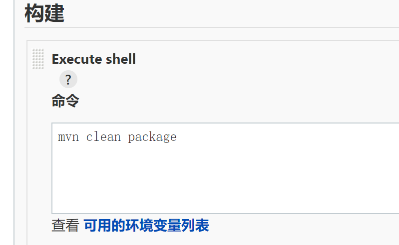
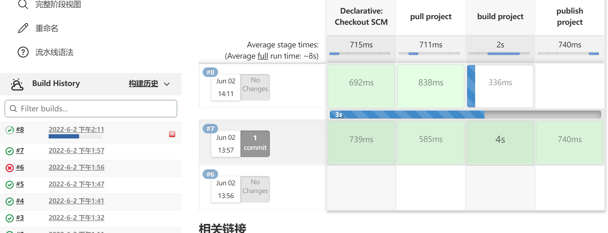
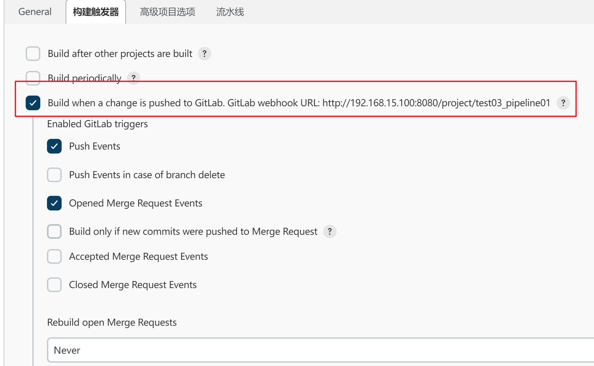
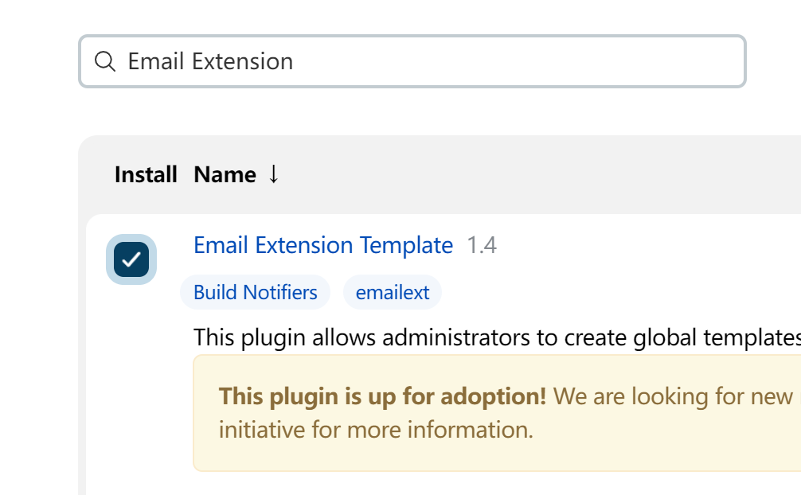
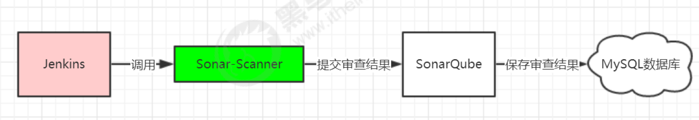
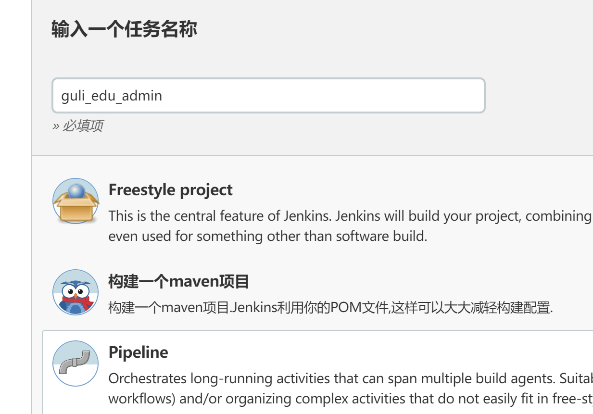

# Jenkins持续集成入门到精通


# 一、持续集成及Jenkins介绍

## 1、软件开发生命周期

软件开发生命周期又叫做SDLC（Software Development Life Cycle），它是集合了计划、开发、测试和部署过程的集合。如下图所示 ：


1. 需求分析
   这是生命周期的第一阶段，根据项目需求，团队执行一个可行性计划的分析。项目需求可能是公司内部
   或者客户提出的。这阶段主要是对信息的收集，也有可能是对现有项目的改善和重新做一个新的项目。
   还要分析项目的预算多长，可以从哪方面受益及布局，这也是项目创建的目标。

2. 设计
   第二阶段就是设计阶段，系统架构和满意状态（就是要做成什么样子，有什么功能），和创建一个项目
   计划。计划可以使用图表，布局设计或者文者的方式呈现。

3. 实现

   第三阶段就是实现阶段，项目经理创建和分配工作给开者，开发者根据任务和在设计阶段定义的目标进
   行开发代码。依据项目的大小和复杂程度，可以需要数月或更长时间才能完成。

4. 测试
   测试人员进行代码测试 ，包括功能测试、代码测试、压力测试等。

5. 维护
   最后进阶段就是对产品不断的进化改进和维护阶段，根据用户的使用情况，可能需要对某功能进行修
   改，bug修复，功能增加等。

## 2、软件开发瀑布模型

瀑布模型是最著名和最常使用的软件开发模型。瀑布模型就是一系列的软件开发过程。它是由制造业繁衍出来的。一个高度化的结构流程在一个方向上流动，有点像生产线一样。在瀑布模型创建之初，没有其它开发的模型，有很多东西全靠开发人员去猜测，去开发。这样的模型仅适用于那些简单的软件开发， 但是已经不适合现在的开发了。下图对软件开发模型的一个阐述。


## 3、软件的敏捷开发

### 3-1、什么是敏捷开发

敏捷开发（Agile Development） 的核心是`迭代开发（Iterative Development）` 与 `增量开发（Incremental Development）`。

- 迭代开发

  对于大型软件项目，传统的开发方式是采用一个大周期（比如一年）进行开发，整个过程就是一次"大开发"；迭代开发的方式则不一样，它将开发过程拆分成多个小周期，即一次"大开发"变成多次"小开发"，每次小开发都是同样的流程，所以看上去就好像重复在做同样的步骤。

  举例来说，SpaceX 公司想造一个大推力火箭，将人类送到火星。但是，它不是一开始就造大火箭，而是先造一个最简陋的小火箭 Falcon 1。结果，第一次发射就爆炸了，直到第四次发射，才成功进入轨道。然后，开发了中型火箭 Falcon 9，九年中发射了70次。最后，才开发 Falcon 重型火箭。如果SpaceX 不采用迭代开发，它可能直到现在还无法上天。

- 增量开发

  软件的每个版本，都会新增一个用户可以感知的完整功能。也就是说，按照新增功能来划分迭代。

  举例来说，房产公司开发一个10栋楼的小区。如果采用增量开发的模式，该公司第一个迭代就是交付一号楼，第二个迭代交付二号楼......每个迭代都是完成一栋完整的楼。而不是第一个迭代挖好10栋楼的地基，第二个迭代建好每栋楼的骨架，第三个迭代架设屋顶......

### 3-2、敏捷开发如何迭代

虽然敏捷开发将软件开发分成多个迭代，但是也要求，每次迭代都是一个完整的软件开发周期，必须按照软件工程的方法论，进行正规的流程管理。


### 3-3、敏捷开发有什么好处

- 早期交付

  敏捷开发的第一个好处，就是早期交付，从而大大降低成本。 还是以上一节的房产公司为例，如果按照传统的"瀑布开发模式"，先挖10栋楼的地基、再盖骨架、然后架设屋顶，每个阶段都等到前一个阶段完成后开始，可能需要两年才能一次性交付10栋楼。也就是说，如果不考虑预售，该项目必须等到两年后才能回款。 敏捷开发是六个月后交付一号楼，后面每两个月交付一栋楼。因此，半年就能回款10%，后面每个月都会有现金流，资金压力就大大减轻了。

- 降低风险

  敏捷开发的第二个好处是，及时了解市场需求，降低产品不适用的风险。 请想一想，哪一种情况损失比较小：10栋楼都造好以后，才发现卖不出去，还是造好第一栋楼，就发现卖不出去，从而改进或停建后面9栋楼？

## 4、什么是持续集成

持续集成（ Continuous integration ， 简称 CI ）指的是，频繁地（一天多次）将代码集成到主干。`持续集成的目的，就是让产品可以快速迭代`，同时还能保持高质量。它的核心措施是，代码集成到主干之前，必须通过自动化测试。只要有一个测试用例失败，就不能集成。通过持续集成， 团队可以快速的从一个功能到另一个功能，简而言之，敏捷软件开发很大一部分都要归功于持续集成。

### 4-1、持续集成的流程

 

根据持续集成的设计，代码从提交到生产，整个过程有以下几步

1. 提交
   流程的第一步，是开发者向代码仓库提交代码。所有后面的步骤都始于本地代码的一次提交（commit）。
2. 测试（第一轮）
   代码仓库对commit操作配置了钩子（hook），只要提交代码或者合并进主干，就会跑自动化测试。
3. 构建
   通过第一轮测试，代码就可以合并进主干，就算可以交付了。交付后，就先进行构建（build），再进入第二轮测试。所谓构建，指的是将源码转换为可以运行的实际代码，比如安装依赖，配置各种资源（样式表、JS脚本、图片）等等。
4. 测试（第二轮）
   构建完成，就要进行第二轮测试。如果第一轮已经涵盖了所有测试内容，第二轮可以省略，当然，这时构建步骤也要移到第一轮测试前面。
5. 部署
   过了第二轮测试，当前代码就是一个可以直接部署的版本（artifact）。将这个版本的所有文件打包（tar filename.tar * ）存档，发到生产服务器。
6. 回滚
   一旦当前版本发生问题，就要回滚到上一个版本的构建结果。最简单的做法就是修改一下符号链接，指向上一个版本的目录。

### 4-2、持续集成的组成要素

- 一个自动构建过程， 从检出代码、 编译构建、 运行测试、 结果记录、 测试统计等都是自动完成的， 无需人工干预。

- 一个代码存储库，即需要版本控制软件来保障代码的可维护性，同时作为构建过程的素材库，一般使用SVN或Git。

- 一个持续集成服务器， Jenkins 就是一个配置简单和使用方便的持续集成服务器。

   

### 4-3、持续集成的好处

- 降低风险，由于持续集成不断去构建，编译和测试，可以很早期发现问题，所以修复的代价就少；
- 对系统健康持续检查，减少发布风险带来的问题；
- 减少重复性工作；
- 持续部署，提供可部署单元包；
- 持续交付可供使用的版本；
- 增强团队信心；


## 5、Jenkins介绍

 

> Jenkins 是一款流行的开源持续集成（Continuous Integration）工具，广泛用于项目开发，具有自动化构建、测试和部署等功能。
>
> 官网： http://jenkins-ci.org/。

Jenkins的特征：

- 开源的Java语言开发持续集成工具，支持持续集成，持续部署。
- 易于安装部署配置：可通过yum安装,或下载war包以及通过docker容器等快速实现安装部署，可方便web界面配置管理。
- 消息通知及测试报告：集成RSS/E-mail通过RSS发布构建结果或当构建完成时通过e-mail通知，生成JUnit/TestNG测试报告。
- 分布式构建：支持Jenkins能够让多台计算机一起构建/测试。
- 文件识别：Jenkins能够跟踪哪次构建生成哪些jar，哪次构建使用哪个版本的jar等。
- 丰富的插件支持：支持扩展插件，你可以开发适合自己团队使用的工具，如git，svn，maven，docker等。

# 二、Jenkins安装和持续集成环境配置

## 1、持续集成流程说明

 

1. 首先，开发人员每天进行代码提交，提交到Git仓库
2. 然后，Jenkins作为持续集成工具，使用Git工具到Git仓库拉取代码到集成服务器，再配合JDK，Maven等软件完成代码编译，代码测试与审查，测试，打包等工作，在这个过程中每一步出错，都重新再执行一次整个流程。
3. 最后，Jenkins把生成的jar或war包分发到测试服务器或者生产服务器，测试人员或用户就可以访问应用。

> 服务器列表

| 名称           | IP地址         | 安装的软件                                          |
| -------------- | -------------- | --------------------------------------------------- |
| 代码托管服务器 | 192.168.15.131 | Gitlab-12.4.2                                       |
| 持续集成服务器 | 192.168.15.100 | Jenkins-2.190.3，JDK1.8，Maven3.6.2，Git，SonarQube |
| 应用测试服务器 | 192.168.15.132 | JDK1.8，Tomcat8.5                                   |

## 2、Gitlab代码托管服务器安装

### 2-1、Gitlab简介

官网： https://about.gitlab.com/
GitLab 是一个用于仓库管理系统的开源项目，使用Git作为代码管理工具，并在此基础上搭建起来的web服务。


GitLab和GitHub一样属于第三方基于Git开发的作品，免费且开源（基于MIT协议），与Github类似，可以注册用户，任意提交你的代码，添加SSHKey等等。`不同的是，GitLab是可以部署到自己的服务器上，数据库等一切信息都掌握在自己手上，适合团队内部协作开发`，你总不可能把团队内部的智慧总放在别人的服务器上吧？简单来说可把GitLab看作个人版的GitHub。

### 2-2、Gitlab安装

1. 安装相关依赖

   ```shell
   yum -y install policycoreutils openssh-server openssh-clients postfix
   ```

2. 启动ssh服务&设置为开机启动

   ```shell
   systemctl enable sshd && sudo systemctl start sshd
   ```

3. 设置postfix开机自启，并启动，postfix支持gitlab发信功能

   ```shell
   systemctl enable postfix && systemctl start postfix
   ```

4. 开放ssh以及http服务，然后重新加载防火墙列表

   ```shell
   firewall-cmd --add-service=ssh --permanent
   firewall-cmd --add-service=http --permanent
   firewall-cmd --reload
   ```

5. 下载gitlab包，并且安装

   1. 在线下载安装包：

      ```shell
      wget https://mirrors.tuna.tsinghua.edu.cn/gitlab-ce/yum/el6/gitlab-ce-12.4.2-ce.0.el6.x86_64.rpm
      ```

   2. 安装

      ```shell
      rpm -i gitlab-ce-12.4.2-ce.0.el6.x86_64.rpm
      ```

       

      可能会报错：

      ```shell
      错误：依赖检测失败：
      	policycoreutils-python 被 gitlab-ce-12.4.2-ce.0.el6.x86_64 需要
      ```

      需要提前安装

      ```shell
      [root@localhost gitlab]# yum install policycoreutils-python
      ```

   3. 修改gitlab配置

      ```shell
      vi /etc/gitlab/gitlab.rb
      ```

      修改gitlab访问地址和端口，默认为80，我们改为82

      ```shell
      external_url 'http://192.168.15.131:82'
      nginx['listen_port'] = 82
      ```

   4. 重载配置及启动gitlab

      ```shell
      gitlab-ctl reconfigure
      gitlab-ctl restart
      ```

   5. 把端口添加到防火墙

      ```shell
      firewall-cmd --zone=public --add-port=82/tcp --permanent
      firewall-cmd --reload
      ```

      启动成功后，访问gitlab可以看到以下修改管理员root密码的页面，修改密码后，然后登录即可

### 2-3、Gitlab添加组、创建用户、创建项目

1. 创建组

   使用管理员 root 创建组，一个组里面可以有多个项目分支，可以将开发添加到组里面进行设置权限，不同的组就是公司不同的开发项目或者服务模块，不同的组添加不同的开发即可实现对开发设置权限的管理

    

   

   

    

2. 创建用户
   创建用户的时候，可以选择Regular（普通用户）或Admin（管理员）类型

   1. 点击Admin Area

       

   2. 创新用户

       

   3. 选择用户类型为Regular

       

   4. 完成创建

   5. 为用户修改密码

       

       

   6. 为用户zhangsan分配组以及权限

        

      五种权限：

      Guest：可以创建issue、发表评论，不能读写版本库 

      Reporter：可以克隆代码，不能提交，QA、PM可以赋予这个权限

      Developer：可以克隆代码、开发、提交、push，普通开发可以赋予这个权限

      Maintainer：可以创建项目、添加tag、保护分支、添加项目成员、编辑项目，核心开发可以赋予这个权限 

      Owner：可以设置项目访问权限 - Visibility Level、删除项目、迁移项目、管理组成员，开发组组长可以赋予这个权限

## 3、源码上传到Gitlab仓库

> 新建一个Springboot项目controller并添加一个接口

1. 开启Git版本控制

    

2. add+commit保存到本地

3. 添加remote仓库

    

4. push推送

    

## 4、持续集成环境(1)——Jenkins安装

1. 安装JDK
   Jenkins需要依赖JDK，所以先安装JDK1.8

   ```shell
   yum install java-1.8.0-openjdk* -y
   ```

   安装目录为：/usr/lib/jvm

2. 获取jenkins安装包
   下载路径：https://mirrors.tuna.tsinghua.edu.cn/jenkins/redhat-stable/文件名

   查看页面有哪些版本

   ```shell
   [root@localhost local]# wget https://mirrors.tuna.tsinghua.edu.cn/jenkins/redhat-stable/jenkins-2.332.2-1.1.noarch.rpm
   ```

3. 安装

   ```shell
   [root@localhost jenkins]# rpm -ivh jenkins-2.332.2-1.1.noarch.rpm
   ```

5. 修改Jenkins配置

   ```shell
   vi /etc/syscofig/jenkins
   JENKINS_USER="root"
   ```
   
5. 配置java安装路径

   找到jdk安装路径，建立软连接

   `/usr/local/jdk/bin/java`为java实际安装路径

   ```shell
   ln -s /usr/local/jdk/bin/java /usr/bin/java
   ```

6. 保存配置

   ```shell
   systemctl daemon-reload
   ```

6. 启动Jenkins

   ```shell
   systemctl start jenkins
   ```

7. 打开浏览器访问，端口默认8080：`http://192.168.15.100:8080`

8. 需要获取密钥

   ```shell
   cat 网站提供的密钥路径
   [root@localhost ~]# cat /var/lib/jenkins/secrets/initialAdminPassword
   7c7551a613b04aaf8643de0ce3e40a0c
   ```

    

## 5、持续集成环境(2)—— Jenkins插件管理

1. 进入后需要安装插件，这里需要配置一下镜像，不然一定会下载失败

   ```shell
   # cd {你的Jenkins工作目录}/updates #进入更新配置位置 一般都是/var/lib/jenkins/
   [root@localhost bin]# cd /var/lib/jenkins/updates
   [root@localhost updates]# sed -i 's/http:\/\/updates.jenkins-ci.org\/download/https:\/\/mirrors.tuna.tsinghua.edu.cn\/jenkins/g' default.json && sed -i 's/http:\/\/www.google.com/https:\/\/www.baidu.com/g' default.json
   ```

2. 重新加载配置+重启jenkins

3. 再次进入页面下载插件

4. 创建用户并进入Jenkins图形化界面

5. 最后，Manager Jenkins — Manage Plugins点击Advanced，把Update Site改为国内插件下载地址

   > https://mirrors.tuna.tsinghua.edu.cn/jenkins/updates/update-center.json

6. 快捷重启jenkns

    

7. 这里可以进行插件下载

    

## 6、持续集成环境(3)——Jenkins用户权限管理

> 我们可以利用Role-based Authorization Strategy 插件来管理Jenkins用户权限

### 6-1、安装插件

  

### 6-2、开启全局权限安全配置

 

授权策略切换为"Role-Based Strategy"，保存

 

### 6-3、创建角色

在系统管理页面进入 `Manage and Assign Roles`

 

点击"Manage Roles"

 

Global roles（全局角色）：管理员等高级用户可以创建基于全局的角色 

Item roles（项目角色）：针对某个或者某些项目的角色 

Node roles（奴隶角色）：节点相关的权限

我们添加以下三个角色：

- baseRole：该角色为全局角色。这个角色需要绑定Overall下面的Read权限，是为了给所有用户绑定最基本的Jenkins访问权限。注意：如果不给后续用户绑定这个角色，`会报错误：用户名 is missing the Overall/Read permission`

  

- role1：该角色为项目角色。使用正则表达式绑定"itcast.\*"，意思是只能操作itcast开头的项目。

- role2：该角色也为项目角色。绑定"itheima.\*"，意思是只能操作itheima开头的项目。

  

### 6-4、创建用户

在系统管理页面进入 Manage Users

 

左边"新建用户"

 

新建用户jack和eric

### 6-5、给用户分配角色

系统管理页面进入Manage and Assign Roles，点击Assign Roles

  

> 绑定规则如下：
> eric用户分别绑定baseRole和role1角色（只能看见itcast开头的项目）
> jack用户分别绑定baseRole和role2角色（只能查看itheima开头的项目）

 


### 6-6、创建项目测试权限

> 以root管理员账户创建两个项目，分别为itcast01和itheima01

 

登录jack和eric的账户查看

jack：

eric:

 

## 7、持续集成环境(4)——Jenkins凭证管理

> 凭据可以用来存储需要密文保护的数据库密码、Gitlab密码信息、Docker私有仓库密码等，以便Jenkins可以和这些第三方的应用进行交互。

### 7-1、安装Credentials Binding插件

要在Jenkins使用凭证管理功能，需要安装Credentials Binding插件


安装插件后，菜单里有个`Manage Credentials`

 

可以添加的凭证有5种：

- Username with password：用户名和密码
- SSH Username with private key： 使用SSH用户和密钥
- Secret file：需要保密的文本文件，使用时Jenkins会将文件复制到一个临时目录中，再将文件路径设置到一个变量中，等构建结束后，所复制的Secret file就会被删除。
- Secret text：需要保存的一个加密的文本串，如钉钉机器人或Github的api token
- Certificate：通过上传证书文件的方式

常用的凭证类型有：`Username with password（用户密码）和SSH Username with private key（SSH密钥）`

接下来以使用Git工具到Gitlab拉取项目源码为例，演示Jenkins的如何管理Gitlab的凭证。

### 7-2、安装Git插件和Git工具

为了让Jenkins支持从Gitlab拉取源码，需要安装Git插件以及在CentOS7上安装Git工具。

1. CentOS7上安装Git工具：

   ```shell
   yum install git -y
   git --version  #安装后查看版本
   ```

### 7-3、用户密码类型

1. 创建凭证(`Jenkins->凭证->系统->全局凭证->添加凭证`)

    

2. 输入gitlab信息

   选择"Username with password"，输入Gitlab的用户名和密码，点击"确定"。

    

    

3. 测试凭证是否可用
   创建一个FreeStyle项目：新建Item->FreeStyle Project(test1)->确定

   前往gitlab复制项目的仓库路径：http://192.168.15.131:82/ithemima_group/web_demo.git

   > 若路径是`http://gitlab.example.com/ithemima_group/web_demo.git`会导致拉取失败，前往gitlab代码托管服务器

   ```shell
   vim /opt/gitlab/embedded/service/gitlab-rails/config/gitlab.yml
   修改以下内容的host和port
   gitlab:
       ## Web server settings (note: host is the FQDN, do not include http://)
       host: 192.168.15.131
       port: 82
       https: false
   #重启
   gitlab-ctl restart
   ```

   将仓库路径配置到项目的源码管理，进入test1项目->配置->源码管理->勾选git->输入Repository URL并选择凭证->保存

    

   保存配置后点击构建”Build Now“ 开始构建项目

    

   构建成功后查看构建的项目日志

    

   查看/var/lib/jenkins/workspace/目录

   ```shell
   [root@localhost ~]# cd /var/lib/jenkins/workspace/
   [root@localhost workspace]# ls
   test1  test1@tmp
   [root@localhost workspace]# cd test1
   [root@localhost test1]# ls
   pom.xml  src
   ```

    项目拉取成功

### 7-4、SSH密钥类型

SSH免密登录示意图

 

1. 在jenkins服务器使用root用户生成公钥和私钥

   ```shell
   [root@localhost test1]# ssh-keygen -t rsa
   [root@localhost test1]# cd /root/.ssh/
   [root@localhost .ssh]# ls
   id_rsa  id_rsa.pub
   ```

   在/root/.ssh/目录保存了公钥和使用

2. 把生成的公钥放在Gitlab中

   以root账户登录->点击头像->Settings->SSH Keys，复制刚才id_rsa.pub文件的内容到这里，点击"Add Key"

    

3. 在Jenkins中添加凭证，配置私钥

   在Jenkins添加一个新的凭证，类型为"SSH Username with private key"，把刚才生成私有文件内容复制过来

   ```shell
   [root@localhost .ssh]# cat id_rsa
   ```

   Username中填root（由于我们在Jenkins服务器使用root生成的公钥私钥）

    

4. 测试凭证是否可用
   新建"test2"项目->源码管理->Git，这次要使用Gitlab的SSH连接，并且选择SSH凭证

    

5. 同样尝试构建项目，如果代码可以正常拉取，代表凭证配置成功！

## 8、持续集成环境(5)——Maven安装和配置

> 在Jenkins集成服务器上，我们需要安装Maven来编译和打包项目。

### 8-1、安装Maven

先上传Maven软件到Jenkins服务器：192.168.15.100 安装路径：/usr/local

```shell
cd/usr/local
#解压
tar -zxvf apache-maven-3.6.1-bin.tar.gz 

#建立软连接
ln -s /usr/local/apache-maven-3.6.1/ /usr/local/maven 

#修改环境变量
vim /etc/profile
export MAVEN_HOME=/usr/local/maven
export PATH=$PATH:$MAVEN_HOME/bin

#让profile文件立即生效
source /etc/profile 

#测试是否安装成功
mvn –v 
```

### 8-2、全局工具配置关联JDK和Maven

1. Jenkins->Global Tool Configuration->JDK->新增JDK，配置如下：

    

2. Jenkins->Global Tool Configuration->Maven->新增Maven，配置如下：

    

3. 添加Jenkins全局变量

   Manage Jenkins->Configure System->全局属性 ，添加三个全局变量：JAVA_HOME、M2_HOME、PATH+EXTRA

   JAVA_HOME:jdk路径

   M2_HOME：maven路径

   PATH+EXTRA：$M2_HOME/bin

### 8-3、修改Maven的settings.xml

1. 创建本地仓库目录

   ```shell
   mkdir /root/repo
   vi /usr/local/maven/conf/settings.xml
   ```

2. 修改本地仓库

   ```xml
     <!-- localRepository
      | The path to the local repository maven will use to store artifacts.
      |
      | Default: ${user.home}/.m2/repository
     -->
     <localRepository>/usr/local/maven/repository</localRepository>
   ```

3. 镜像处追加阿里云私服地址：

   ```xml
   <mirror>
   	<id>alimaven</id>
       <name>aliyun maven</name>
       <url>http://maven.aliyun.com/nexus/content/groups/public/</url>
       <mirrorof>central</mirrorof>
   </mirror>
   ```

### 8-4、测试Maven是否配置成功

1. 使用之前的gitlab密码测试test2项目，修改配置

    

2. 构建->增加构建步骤->Execute Shell 输入命令：mvn clean package

    

3. 保存后再次构建，如果可以把项目打成jar包，代表maven环境配置成功啦！

   > 若报错 `Failed to create parent directories for tracking file...`
   >
   > 需要给仓库文件夹添加权限

   ```shell
   chmod 777 /usr/local/maven/repository
   ```

4. 查看生成的jar包

   ```shell
   [root@localhost test2]# ls
   pom.xml  src  target
   [root@localhost test2]# cd target
   [root@localhost target]# ls
   classes                 maven-archiver    test-classes
   generated-sources       maven-status      web_demo-0.0.1-SNAPSHOT.jar
   generated-test-sources  surefire-reports  web_demo-0.0.1-SNAPSHOT.jar.original
   ```

## 9、持续集成环境(6)——Tomcat安装和配置

### 9-1、安装Tomcat8.5

> 前提jdk安装成功
>

1. 把apache-tomcat-8.5.78.tar.gz压缩包上传到192.168.15.132测试服务器的/opt

2. 解压压缩包

   ```shell
   tar -xzf apache-tomcat-8.5.78.tar.gz
   ```

3. 创新目录

   ```shell
   mkdir -p /opt/tomcat
   ```

4. 建立软连接

   ```shell
   ln -s /download/apache-tomcat-8.5.78 /opt/tomcat
   ```

5. 启动tomcat

   ```shell
   /opt/tomcat/bin/startup.sh
   ```

   为8080端口开放防火墙：

   ```shell
   firewall-cmd --permanent --add-port=8080/tcp
   ```
   
   访问：192.168.15.132:8080
   
    

### 9-2、配置Tomcat用户角色权限

> 默认情况下Tomcat是没有配置用户角色权限的

 

没有定义用户

1. 后续Jenkins部署项目到Tomcat服务器，需要用到Tomcat的用户，所以修改tomcat以下配置，添加用户及权限

   ```xml
   vi /opt/tomcat/conf/tomcat-users.xml
   <tomcat-users>
       <role rolename="tomcat"/>
       <role rolename="role1"/>
       <role rolename="manager-script"/>
       <role rolename="manager-gui"/>
       <role rolename="manager-status"/>
       <role rolename="admin-gui"/>
       <role rolename="admin-script"/>
       <user username="tomcat" password="tomcat" roles="manager-gui,manager-script,tomcat,admin-gui,admin-script"/>
   </tomcat-users>
   ```

   用户和密码都是：tomcat

2. 注意：为了能够刚才配置的用户登录到Tomcat，还需要修改以下配置

   ```xml
   vi /opt/tomcat/webapps/manager/META-INF/context.xml
   <!--
   <Valve className="org.apache.catalina.valves.RemoteAddrValve" allow="127\.\d+\.\d+\.\d+|::1|0:0:0:0:0:0:0:1" />
   -->
   ```

   将上面注释掉

3. 重启Tomcat，访问测试

   ```shell
   # 停止
   /opt/tomcat/bin/shutdown.sh
   # 启动
   /opt/tomcat/bin/startup.sh
   ```

4. 访问：http://192.168.15.132:8080/manager/html 账户密码tomcat

    

5. 效果

    

# 三、Jenkins构建Maven项目


## 1、Jenkins构建的项目类型介绍

Jenkins中自动构建项目的类型有很多，常用的有以下三种：

- 自由风格软件项目（FreeStyle Project）
- Maven项目（Maven Project）
- 流水线项目（Pipeline Project）

每种类型的构建其实都可以完成一样的构建过程与结果，只是在操作方式、灵活度等方面有所区别，在实际开发中可以根据自己的需求和习惯来选择。（PS：个人推荐使用流水线类型，因为灵活度非常高）

## 2、Jenkins项目构建类型(1)-自由风格项目构建

下面演示创建一个自由风格项目来完成项目的集成过程：

> 拉取代码->编译->打包->部署

### 2-1、拉取代码

1. 创建项目

    

2. 配置源码管理，从gitlab拉取代码 

### 2-2、编译打包

> 构建->添加构建步骤->Executor Shell

```shell
echo "开始编译和打包"
mvn clean package
echo "编译和打包结束"
```

### 2-3、部署

把项目部署到远程的Tomcat里面

1. 安装 Deploy to container插件

   > Jenkins本身无法实现远程部署到Tomcat的功能，需要安装Deploy to container插件实现

    

2. 添加Tomcat用户凭证

    

3. 添加构建后操作

    

4. 点击"Build Now"，开始构建过程

5. 构建成功后在打开tomcat访问项目页面

### 2-4、演示改动代码后的持续集成

1. IDEA中源码修改并提交到gitlab
2. 在Jenkins中项目重新构建
3. 访问Tomcat

## 3、Jenkins项目构建类型(2)-Maven项目构建

1. 安装Maven Integration插件

    

   安装后重启

2. 创建Maven项目

    

3. 配置项目
   拉取代码和远程部署的过程和自由风格项目一样，只是"构建"部分不同

    

4. 其余添加git仓库和构建后步骤和前面相同

5. 运行部署

## 4、Jenkins项目构建类型(3)-Pipeline流水线项目构建

### 4-1、Pipeline简介

1. 概念
   Pipeline，简单来说，就是一套运行在 Jenkins 上的工作流框架，将原来独立运行于单个或者多个节点的任务连接起来，实现单个任务难以完成的复杂流程编排和可视化的工作。
2. 使用Pipeline有以下好处（来自翻译自官方文档）：
   代码：Pipeline以代码的形式实现，通常被检入源代码控制，使团队能够编辑，审查和迭代其传送流程。 持久：无论是计划内的还是计划外的服务器重启，Pipeline都是可恢复的。 可停止：Pipeline可接收交互式输入，以确定是否继续执行Pipeline。 多功能：Pipeline支持现实世界中复杂的持续交付要求。它支持fork/join、循环执行，并行执行任务的功能。 可扩展：Pipeline插件支持其DSL的自定义扩展 ，以及与其他插件集成的多个选项。
3. 如何创建 Jenkins Pipeline呢？
   - Pipeline 脚本是由 Groovy 语言实现的，但是我们没必要单独去学习 Groovy
   - Pipeline 支持两种语法：Declarative(声明式)和 Scripted Pipeline(脚本式)语法
   - Pipeline 也有两种创建方法：可以直接在 Jenkins 的 Web UI 界面中输入脚本；也可以通过创建一个 Jenkinsfile 脚本文件放入项目源码库中（一般我们都推荐在 Jenkins 中直接从源代码控制(SCM)中直接载入 Jenkinsfile Pipeline 这种方法）。

### 4-2、安装Pipeline插件

1. Manage Jenkins->Manage Plugins->可选插件

    

2. 安装插件后，创建项目的时候多了“流水线”类型

    

### 4-3、Pipeline语法快速入门

#### 4-3-1、Declarative声明式-Pipeline

1. 创建项目

    

2. 流水线->选择HelloWorld模板

    

   生成内容：

   ```shell
   pipeline {
       agent any
   
       stages {
           stage('Hello') {
               steps {
                   echo 'Hello World'
               }
           }
       }
   }
   ```

   1. stages：代表整个流水线的所有执行阶段。通常stages只有1个，里面包含多个stage
   2. stage：代表流水线中的某个阶段，可能出现n个。一般分为拉取代码，编译构建，部署等阶段。
   3. steps：代表一个阶段内需要执行的逻辑。steps里面是shell脚本，git拉取代码，ssh远程发布等任意内容。

3. 编写一个简单声明式Pipeline

   ```shell
   pipeline {
       agent any
   
       stages {
           stage("pull project") {
               steps {
                   echo '拉取代码'
               }
           }
           stage("build project") {
               step{
                   echo '编译构建'
               }
           }
           stage("publish project") {
               step{
                   echo '项目部署'
               }
           }
       }
   }
   ```

4. 点击保存并构建，可以看到整个构建过程

    

    

#### 4-3-2、Scripted Pipeline脚本式-Pipeline

1. 创建流水线项目：test03_pipeline02

2. 这次选择"Scripted Pipeline"

    

3. 上面得太复杂我们来解释一下脚本式

   ```shell
   node {
       def mvnHome
       stage('Preparation') { // for display purposes
           // Get some code from a GitHub repository
           git 'https://github.com/jglick/simple-maven-project-with-tests.git'
           // Get the Maven tool.
           // ** NOTE: This 'M3' Maven tool must be configured
           // **       in the global configuration.
           mvnHome = tool 'M3'
       }
       stage('Build') {
           // Run the maven build
           withEnv(["MVN_HOME=$mvnHome"]) {
               if (isUnix()) {
                   sh '"$MVN_HOME/bin/mvn" -Dmaven.test.failure.ignore clean package'
               } else {
                   bat(/"%MVN_HOME%\bin\mvn" -Dmaven.test.failure.ignore clean package/)
               }
           }
       }
       stage('Results') {
           junit '**/target/surefire-reports/TEST-*.xml'
           archiveArtifacts 'target/*.jar'
       }
   }
   ```

   - Node：节点，一个 Node 就是一个 Jenkins 节点，Master 或者 Agent，是执行 Step 的具体运行环境，后续讲到Jenkins的Master-Slave架构的时候用到。
   - Stage：阶段，一个 Pipeline 可以划分为若干个 Stage，每个 Stage 代表一组操作，比如：Build、Test、Deploy，Stage 是一个逻辑分组的概念。
   - Step：步骤，Step 是最基本的操作单元，可以是打印一句话，也可以是构建一个 Docker 镜像，由各类 Jenkins 插件提供，比如命令：sh ‘make’，就相当于我们平时 shell 终端中执行 make 命令一样。

4. 编写一个简单的脚本式Pipeline

   ```shell
   node {
   	def mvnHome
   	stage('pull project') { // for display purposes
   		echo '拉取代码'
   	}
   	stage('build project') {
   		echo '编译构建'
   	}
   	stage('publish project') {
   		echo '项目部署'
   	}
   }
   ```

   构建结果和声明式一样！

### 4-4、拉取代码

1. 使用生成拉取代码的工具:从流水线语法进入

     

2. 选择拉取代码

    

   再输入git仓库地址 SSH/HTTP登录和分支名称

3. 生成脚本

   ```shell
   checkout([$class: 'GitSCM', branches: [[name: '*/main']], extensions: [], userRemoteConfigs: [[credentialsId: 'bbe63999-0cd0-49b6-83bc-aaafd78081d3', url: 'git@192.168.15.131:ithemima_group/web_jsp_demo.git']]])
   ```

4. 构建

    

### 4-5、编译打包

1. 片段生成器->选择sh:Shell Script

2. Shell Script中输入

   ```shell
   mvn clean package
   ```

3. 生成脚本

   ```shell
   sh 'mvn clean package'
   ```

4. 完整脚本

   ```shell
   pipeline {
       agent any
   
       stages {
           stage("pull project") {
               steps {
                   checkout([$class: 'GitSCM', branches: [[name: '*/main']], extensions: [], userRemoteConfigs: [[credentialsId: 'bbe63999-0cd0-49b6-83bc-aaafd78081d3', url: 'git@192.168.15.131:ithemima_group/web_jsp_demo.git']]])
               }
           }
           stage("build project") {
               steps {
                   sh 'mvn clean package'
               }
           }
           stage("publish project") {
               steps {
                   echo '项目部署'
               }
           }
       }
   }
   ```

5. 构建测试

    

### 4-6、部署

1. 片段生成器->选择deloy:Deloy war/ear to a container

2. 输入部署目标的信息

    

3. 生成脚本

   ```shell
   deploy adapters: [tomcat8(credentialsId: '6b3fda01-435d-417c-bd32-fcdf3743d45c', path: '', url: 'http://192.168.15.132:8080/')], contextPath: null, war: 'target/*.war'
   ```

   完整脚本

   ```shell
   pipeline {
       agent any
   
       stages {
           stage("pull project") {
               steps {
                   checkout([$class: 'GitSCM', branches: [[name: '*/main']], extensions: [], userRemoteConfigs: [[credentialsId: 'bbe63999-0cd0-49b6-83bc-aaafd78081d3', url: 'git@192.168.15.131:ithemima_group/web_jsp_demo.git']]])
               }
           }
           stage("build project") {
               steps {
                   sh 'mvn clean package'
               }
           }
           stage("publish project") {
               steps {
                   deploy adapters: [tomcat8(credentialsId: '6b3fda01-435d-417c-bd32-fcdf3743d45c', path: '', url: 'http://192.168.15.132:8080/')], contextPath: null, war: 'target/*.war'
               }
           }
       }
   }
   ```

4. 构建测试

### 4-7、Pipeline Script from SCM

刚才我们都是直接在Jenkins的UI界面编写Pipeline代码，这样不方便脚本维护，建议把Pipeline脚本放在项目中（一起进行版本控制）

1. 在项目根目录建立Jenkinsfile文件，把内容复制到该文件中

    

2. 推送到gitlab

3. 回到Jenkins在项目中引用该文件

    

4. 构建测试

## 5、Jenkins项目构建细节(1)-常用的构建触发器


Jenkins内置4种构建触发器：

1. 触发远程构建
2. 其他工程构建后触发（Build after other projects are build）
3. 定时构建（Build periodically）
4. 轮询SCM（Poll SCM）

 

### 5-1、触发远程构建

   

触发构建url：http://192.168.15.100:8080/job/test03_pipeline01/build?token=身份验证令牌

通常token需要加密，这里测试随便写一串也可以

调用连接后：



 

### 5-2、其他工程构建后触发（Build after other projects are build）

1. 创建pre_job流水线工程

2. 流水线脚本使用默认的HelloWorld

3. 前往test03_pipeline01项目配置其他工程构建后触发

    

4. 构建pre_job工程后查看test03_pipeline01工程

   开始构建了

    

### 5-3、定时构建

定时字符串从左往右分别为： 分 时 日 月 周

 

一些表达式例子：

- 每30分钟构建一次：H代表形参 H/30 * * * * 10:02 10:32
- 每2个小时构建一次: H H/2 * * *
- 每天的8点，12点，22点，一天构建3次： (多个时间点中间用逗号隔开) 0 8,12,22 * * *
- 每天中午12点定时构建一次 H 12 * * *
- 每天下午18点定时构建一次 H 18 * * *
- 在每个小时的前半个小时内的每10分钟 H(0-29)/10 * * * *
- 每两小时一次，每个工作日上午9点到下午5点(也许是上午10:38，下午12:38，下午2:38，下午4:38) H H(9-16)/2 * * 1-5

测试H/2 * * * * 每两分钟构建一次

 

### 5-4、轮询SCM

轮询SCM，是指定时扫描本地代码仓库的代码是否有变更，如果代码有变更就触发项目构建。

 

注意：这次构建触发器，Jenkins会定时扫描本地整个项目的代码，增大系统的开销，不建议使用。

## 6、Jenkins项目构建细节(2)-Generic Webhook Trigger自动触发构建(*)

刚才我们看到在Jenkins的内置构建触发器中，轮询SCM可以实现Gitlab代码更新，项目自动构建，但是该方案的性能不佳。那有没有更好的方案呢？ 有的。就是利用Gitlab的webhook实现代码push到仓库，立即触发项目自动构建。

 

### 6-1、安装Generic Webhook Trigger插件

需要安装两个插件：Generic Webhook Trigger和GitLab

### 6-2、Jenkins设置自动构建

 

使用默认勾选的选项

等会需要把生成的webhook URL`http://192.168.15.100:8080/project/test03_pipeline01`配置到Gitlab中。

### 6-3、Gitlab配置webhook

1. 开启webhook功能

   使用root账户登录到后台，点击Admin Area -> Settings -> Network 

   勾选"Allow requests to the local network from web hooks and services"

    

2. 在项目添加webhook
   gitlab进入项目->Settings->Integrations

   

   注意：以下设置必须完成，否则会报错！

   Manage Jenkins->Configure System

    

## 7、Jenkins项目构建细节(3)-Jenkins的参数化构建

有时在项目构建的过程中，我们需要根据用户的输入动态传入一些参数，从而影响整个构建结果，这时我们可以使用参数化构建。

Jenkins支持非常丰富的参数类型

 

接下来演示通过输入gitlab项目的分支名称来部署不同分支项目。

### 7-1、项目创建分支，并推送到Gitlab上

1. 项目创建分支v1
2. 稍微修改代码
3. 推送到Gitlab上

### 7-2、在Jenkins添加字符串类型参数

1. 选择String Parameter

2. 输入分支参数

    

3. 这时候手动点击构建时需要输入分支的名称

    

### 7-3、改动pipeline流水线代码

原本固定拉取main分支的代码：

 

现在修改为通过输入一个分支参数实现需要拉取代码的分支

```java
branches: [[name: '*/${branch}']]
```

将代码推送到gitlab后，会自动拉取v1分支的项目到jenkins


## 8、Jenkins项目构建细节(4)-配置邮箱服务器发送构建结果

### 8-1、安装Email Extension插件

 

### 8-2、Jenkins设置邮箱相关参数

1. 先前往QQ邮箱的设置离开启**POP3/IMAP/SMTP**服务

    

2. 生成授权码

    

3. Configure System中设置邮箱相关参数（**Jenkins Location**、**Extended E-mail Notification**、**邮件通知**）

   Manage Jenkins->Configure System

   我这里使用的是QQ邮箱

   - SMTP server：smtp.qq.com
   - SMTP Port:不开启SSL加密默认为25，开启则是465
   - Credentials：添加发送邮箱以及密码（授权码）
   - Default user e-mail suffix：邮箱后缀这里是@qq.com
   - Default Content Type:内容类型 文本/HTM
   - Default Recipients：接收回信的用户

   最终测试结果：

    

### 8-3、准备邮件内容

在项目根目录编写email.html，并把文件推送到Gitlab，内容如下：

```html
<!DOCTYPE html>
<html>
<head>
    <meta charset="UTF-8">
    <title>${PROJECT_NAME}-第${BUILD_NUMBER}次构建日志</title>
</head>

<body leftmargin="8" marginwidth="0" topmargin="8" marginheight="4"
      offset="0">
<table width="95%" cellpadding="0" cellspacing="0"
       style="font-size: 11pt; font-family: Tahoma, Arial, Helvetica, sans-serif">
    <tr>
        <td>(本邮件是程序自动下发的，请勿回复！)<br/></td>
    </tr>
    <tr>
        <td><h2>
            <font color="#0000FF">构建结果 - ${BUILD_STATUS}</font>
        </h2></td>
    </tr>
    <tr>
        <td><br />
            <b><font color="#0B610B">构建信息</font></b>
            <hr size="2" width="100%" align="center" /></td>
    </tr>
    <tr>
        <td>
            <ul>
                <li>项目名称 ： ${PROJECT_NAME}</li>
                <li>构建编号 ： 第${BUILD_NUMBER}次构建</li>
                <li>触发原因： ${CAUSE}</li>
                <li>构建日志： <a href="${BUILD_URL}console">${BUILD_URL}console</a></li>
                <li>构建  Url ： <a href="${BUILD_URL}">${BUILD_URL}</a></li>
                <li>工作目录 ： <a href="${PROJECT_URL}ws">${PROJECT_URL}ws</a></li>
                <li>项目  Url ： <a href="${PROJECT_URL}">${PROJECT_URL}</a></li>
            </ul>
        </td>
    </tr>
    <tr>
        <td><b><font color="#0B610B">Changes Since Last Successful Build:</font></b>
            <hr size="2" width="100%" align="center" /></td>
    </tr>
    <tr>
        <td>
            <ul>
                <li>历史变更记录 : <a href="${PROJECT_URL}changes">${PROJECT_URL}changes</a></li>
            </ul> ${CHANGES_SINCE_LAST_SUCCESS,reverse=true, format="Changes for Build #%n:<br />%c<br />",showPaths=true,changesFormat="<pre>[%a]<br />%m</pre>",pathFormat="    %p"}
        </td>
    </tr>
    <tr>
        <td> <hr size="2" width="100%" align="center" /></td>
    </tr>
    <tr>
        <td></td>
    </tr>
    <tr>
        <td><b><font color="#0B610B">构建情况总览:</font></b>${TEST_COUNTS,var="fail"}<br/>
            <hr size="2" width="100%" align="center" /></td>
    </tr>
    <tr>`在这里插入代码片`
        <td><textarea cols="80" rows="30" readonly="readonly"
                      style="font-family: Courier New">${BUILD_LOG,maxLines=23}</textarea>
        </td>
    </tr>
</table>
</body>
</html>
```

里面有些jenkins内置的参数

- BUILD_NUMBER:构建的次数
- BUILD_STATUS:构建状态
- PROJECT_NAME:项目名
- CAUSE：触发原因
- BUILD_URL：构建路径
- PROJECT_URL：项目路径

### 8-4、编写Jenkinsfile添加构建后发送邮件

```java
pipeline {
    agent any

    stages {
        stage("pull project") {
            steps {
                checkout([$class: 'GitSCM', branches: [[name: '*/${branch}']], extensions: [], userRemoteConfigs: [[credentialsId: 'bbe63999-0cd0-49b6-83bc-aaafd78081d3', url: 'git@192.168.15.131:ithemima_group/web_jsp_demo.git']]])
            }
        }
        stage("build project") {
            steps {
                sh 'mvn clean package'
            }
        }
        stage("publish project") {
            steps {
                deploy adapters: [tomcat8(credentialsId: '6b3fda01-435d-417c-bd32-fcdf3743d45c', path: '', url: 'http://192.168.15.132:8080/')], contextPath: null, war: 'target/*.war'
            }
        }
    }
    post {
        always {
            emailext(
                subject: '构建通知：${PROJECT_NAME} - Build # ${BUILD_NUMBER} - ${BUILD_STATUS}!',
                body: '${FILE,path="email.html"}',
                to: '2250231923@qq.com'
            )
        }
    }
}
```

推送代码到gitlab自动发送邮件：

 

## 9、Jenkins+SonarQube代码审查(1) - 安装SonarQube

### 9-1、SonaQube简介

SonarQube是一个用于管理代码质量的开放平台，可以快速的定位代码中潜在的或者明显的错误。目前
支持java,C#,C/C++,Python,PL/SQL,Cobol,JavaScrip,Groovy等二十几种编程语言的代码质量管理与检测。

官网：https://www.sonarqube.org/

### 9-2、环境要求

> JDK1.8、Mysql5.7、SonarQube6.7.4均安装在持续集成服务器

### 9-3、安装SonarQube

1. 在MySQL创建sonar数据库

   ```mysql
   mysql> create database sonar;
   Query OK, 1 row affected (0.02 sec)
   ```

2. 下载sonar压缩包：https://www.sonarqube.org/downloads/

3. 解压sonar，并设置权限

   ```shell
   #安装解压zip的工具
   yum install unzip
   #解压sonarqube
   unzip sonarqube-6.7.7.zip
   #创建目录
   mkdir /opt/sonar
   #移动文件
   mv sonarqube-6.7.7/* /opt/sonar
   #创建sonar用户，必须sonar用于启动，否则报错
   useradd sonar
   #更改sonar目录及文件权限
   chown -R sonar. /opt/sonar
   ```

4. 修改sonar配置文件

   ```properties
   vi /opt/sonar/conf/sonar.properties
   
   sonar.jdbc.username=root 
   sonar.jdbc.password=123456
   sonar.jdbc.url=jdbc:mysql://localhost:3306/sonar?
   useUnicode=true&characterEncoding=utf8&rewriteBatchedStatements=true&useConfigs=maxPerformance&useSSL=false
   ```

   username和password根据自身mysql数据库的账户密码填

   注意：sonar默认监听9000端口，如果9000端口被占用，需要更改。

5. 启动sonar

   ```shell
   #启动 sonar表示切换sonar账户启动
   su sonar /opt/sonar/bin/linux-x86-64/sonar.sh start
   #查看状态
   su sonar /opt/sonar/bin/linux-x86-64/sonar.sh status
   #停止
   su sonar /opt/sonar/bin/linux-x86-64/sonar.sh stop
   #查看日志
   tail -f /opt/sonar/logs/sonar.log 查看日志
   ```

6. 访问sonar：http://192.168.15.100:9000

   

7. log in登录 默认账户：admin/admin

8. 登录后需要先创建token，随便输入一个名字会生成密钥

    

   > 09dc4035fd82720d1210e5f8643c130e3391cd45

   token后面会用到

## 10、Jenkins+SonarQube代码审查(2) - 实现代码审查



### 10-1、安装SonarQube Scanner插件

 

### 10-2、添加SonarQube凭证

 

### 10-3、Jenkins配置Sonar-Scanner

Manage Jenkins->Global Tool Configuration

 

### 10-4、Jenkins进行SonarQube配置

Manage Jenkins->Configure System->SonarQube servers

   

### 10-5、SonaQube关闭审查结果上传到SCM功能

 

### 10-6、在项目添加SonaQube代码审查（非流水线项目）

添加构建步骤：web_demo_freestyle -> 配置 -> 构建 -> 增加构建步骤 -> Execute SonarQube Scanner

 

```properties
#项目key 唯一
sonar.projectKey=web_demo_freestyle
# this is the name and version displayed in the SonarQube UI. Was mandatory prior to SonarQube 6.1.
#项目名
sonar.projectName=web_demo_freestyle
#项目版本
sonar.projectVersion=1.0

#扫描的项目路径 .表示项目路径下所有文件 也可以扫描/src/main/**等
sonar.sources=.
#排除一些不扫描的文件
sonar.exclusions=**/test/**,**/target/**

#jdk版本
sonar.java.source=1.8
sonar.java.target=1.8

# Encoding of the source code. Default is default system encoding
sonar.sourceEncoding=UTF-8
```

开始构建，构建完成后打开sonar

 


### 10-7、在项目添加SonaQube代码审查（流水线项目）

1. 项目根目录下，创建sonar-project.properties文件

   ```properties
   # must be unique in a given SonarQube instance
   sonar.projectKey=web_demo_pipeline
   # this is the name and version displayed in the SonarQube UI. Was mandatory
   prior to SonarQube 6.1.
   sonar.projectName=web_demo_web_demo_pipeline
   sonar.projectVersion=1.0
   # Path is relative to the sonar-project.properties file. Replace "\" by "/" on
   Windows.
   # This property is optional if sonar.modules is set.
   sonar.sources=.
   sonar.exclusions=**/test/**,**/target/**
   sonar.java.source=1.8
   sonar.java.target=1.8
   # Encoding of the source code. Default is default system encoding
   sonar.sourceEncoding=UTF-8
   ```

2. 修改Jenkinsfile，加入SonarQube代码审查阶段

   ```shell
   script {
   	scannerHome = tool 'sonar-scanner' #引入SonarQube-Scanner工具 在全局配置中配置的Name
   }
   withSonarQubeEnv('sonarqube6.7.7') {  #引入SonarQube 在Configuare System配置的Name
   	sh "${scannerHome}/bin/sonar-scanner" #调用sonar-scanner工具扫描
   }
   ```

3. 推送到gitlab

4. 新建一个流水线项目，配置参数和流水线

5. 构建后到SonarQube的UI界面查看审查结果

   

#  四、Jenkins+Docker+SpringCloud微服务持续集成(上)

## 1、微服务持续集成流程说明

 

大致流程说明：

1. 开发人员每天把代码提交到Gitlab代码仓库
2. Jenkins从Gitlab中拉取项目源码，编译并打成jar包，然后构建成Docker镜像，将镜像上传到Harbor私有仓库。
3. Jenkins发送SSH远程命令，让生产部署服务器到Harbor私有仓库拉取镜像到本地，然后创建容器。
4. 最后，用户可以访问到容器

### 1-1、服务列表(下划线的软件为需要安装的软件，黑色代表已经安装)

| 服务器名称       | IP地址         | 安装的软件                                   |
| ---------------- | -------------- | -------------------------------------------- |
| 代码托管服务器   | 192.168.15.131 | Gitlab                                       |
| 持续集成服务器   | 192.168.15.100 | Jenkins,Maven,<u>Docker20.10.16-ce</u>       |
| Docker仓库服务器 | 192.168.15.133 | <u>Docker20.10.16-ce</u>、<u>Harbor1.9.2</u> |
| 生产部署服务器   | 192.168.15.132 | <u>Docker20.10.16-ce</u>                     |

## 2、SpringCloud微服务源码概述

项目架构：前后端分离
后端技术栈：SpringBoot+SpringCloud+SpringDataJpa（Spring全家桶）

微服务项目结构：

- tensquare_parent：父工程，存放基础配置
- tensquare_common：通用工程，存放工具类
- tensquare_eureka_server：SpringCloud的Eureka注册中心
- tensquare_zuul：SpringCloud的网关服务
- tensquare_admin_service：基础权限认证中心，负责用户认证（使用JWT认证）
- tensquare_gathering：一个简单的业务模块，活动微服务相关逻辑

数据库结构：

- tensquare_user：用户认证数据库，存放用户账户数据。对应tensquare_admin_service微服务
- tensquare_gathering：活动微服务数据库。对应tensquare_gathering微服务

微服务配置分析：

- tensquare_eureka
- tensquare_zuul
- tensquare_admin_service
- tensquare_gathering

## 3、本地部署(1)-SpringCloud微服务部署

### 3-1、本地运行微服务

1. 逐一启动微服务
2. 使用postman测试功能是否可用

### 3-2、本地部署微服务

1. SpringBoot微服务项目打包

   必须导入该插件

   ```xml
   <plugin>
       <groupId>org.springframework.boot</groupId>
       <artifactId>spring-boot-maven-plugin</artifactId>
   </plugin>
   ```

   打包后在target下产生jar包

2. 本地运行微服务的jar包

   ```shell
   java -jar xxx.jar
   ```


## 4、本地部署(2)-前端静态web网站

前端技术栈：NodeJS+VueJS+ElementUI
使用Visual Studio Code打开源码

1. 本地运行

   ```shell
   npm run dev
   ```

2. 打包静态web网站

   ```shell
   npm run build
   ```

   打包后，产生dist目录的静态文件

3. 部署到nginx服务器

   把dist目录的静态文件拷贝到nginx的html目录，启动nginx

4. 启动nginx，并访问http://localhost:9001(我这里在配置文件配置了9001端口)

## 5、环境准备(1)-Docker快速入门

>
> Docker技术就是让我们更加高效轻松地将任何应用在Linux服务器部署和使用。

### 5-1、Docker安装

安装地址：https://docs.docker.com/engine/install/centos/

1. 确定你是CentOS7及以上版本

   ```shell
   [root@localhost ~]# cat /etc/redhat-release
   CentOS Linux release 7.4.1708 (Core)
   ```

2. 卸载旧版本

   ```shell
   sudo yum remove docker \
                     docker-client \
                     docker-client-latest \
                     docker-common \
                     docker-latest \
                     docker-latest-logrotate \
                     docker-logrotate \
                     docker-engine
   ```

3. yum安装gcc相关

   > 确保能连接网络

   ```shell
   [root@localhost ~]# yum -y install gcc
   ...
   [root@localhost ~]# yum -y install gcc-c++
   ...
   ```

4. 安装需要的软件包

   ```shell
   [root@localhost ~]# yum install -y yum-utils
   ```

5. 设置stable镜像仓库

   大坑：由于官网的镜像仓库路径是外网路径，后面会经常出错

    

    正确的镜像仓库路径：http://mirrors.aliyun.com/docker-ce/linux/centos/docker-ce.repo

   ```shell
   [root@localhost ~]# yum-config-manager --add-repo http://mirrors.aliyun.com/docker-ce/linux/centos/docker-ce.repo
   ```

6. 更新yum软件包索引

   ```shell
   [root@localhost ~]# yum makecache fast
   ```

7. 安装DOCKER CE

   ```shell
   [root@localhost ~]# yum -y install docker-ce docker-ce-cli containerd.io
   ```

   执行结果：

    

8. 启动docker

   ```shell
   systemctl start docker
   ```

9. 测试

   ```shell
   [root@localhost ~]# docker version
   ```

    

10. 配置镜像加速器

    > 推荐安装1.10.0以上版本的Docker客户端

    您可以通过修改daemon配置文件`/etc/docker/daemon.json`来使用加速器

    ```shell
    sudo mkdir -p /etc/docker
    sudo tee /etc/docker/daemon.json <<-'EOF'
    {
      "registry-mirrors": ["https://{自已的阿里云镜像编码}.mirror.aliyuncs.com"]
    }
    EOF
    sudo systemctl daemon-reload
    sudo systemctl restart docker
    ```


其余镜像操作和容器操作自行学习Docker

## 6、环境准备(2)-Dockerfile镜像脚本快速入门

### 6-1、Dockerfile简介

Dockerfile其实就是我们用来构建Docker镜像的源码，当然这不是所谓的编程源码，而是一些命令的组合，只要理解它的逻辑和语法格式，就可以编写Dockerfile了。简单点说，Dockerfile的作用：它可以让用户个性化定制Docker镜像。因为工作环境中的需求各式各样，网络上的镜像很难满足实际的需求。


### 6-2、Dockerfile常见命令

 

RUN、CMD、ENTRYPOINT的区别？

- RUN：用于指定 docker build 过程中要运行的命令，即是创建 Docker 镜像（image）的步骤
- CMD：设置容器的启动命令， Dockerfile 中只能有一条 CMD 命令，如果写了多条则最后一条生效，CMD不支持接收docker run的参数。
- ENTRYPOINT：入口程序是容器启动时执行的程序， docker run 中最后的命令将作为参数传递给入口程序 ，ENTRYPOINY类似于 CMD 指令，但可以接收docker run的参数 。

以下是mysql官方镜像的Dockerfile示例：

```dockerfile
FROM oraclelinux:7-slim
ARG MYSQL_SERVER_PACKAGE=mysql-community-server-minimal-5.7.28
ARG MYSQL_SHELL_PACKAGE=mysql-shell-8.0.18

# Install server
RUN yum install -y https://repo.mysql.com/mysql-community-minimal-releaseel7.
rpm \
https://repo.mysql.com/mysql-community-release-el7.rpm \
&& yum-config-manager --enable mysql57-server-minimal \
&& yum install -y \
$MYSQL_SERVER_PACKAGE \
$MYSQL_SHELL_PACKAGE \
libpwquality \
&& yum clean all \
&& mkdir /docker-entrypoint-initdb.d
VOLUME /var/lib/mysql
COPY docker-entrypoint.sh /entrypoint.sh
COPY healthcheck.sh /healthcheck.sh
ENTRYPOINT ["/entrypoint.sh"]
HEALTHCHECK CMD /healthcheck.sh
EXPOSE 3306 33060
CMD ["mysqld"]
```

### 6-3、使用Dockerfile制作微服务镜像

> 我已经在虚拟机启动了nacos服务器
>
> 我们利用Dockerfile制作一个Gateway网关模块的镜像

1. 上传Gateway模块的微服务jar包到linux

2. 编写Dockerfile

   ```dockerfile
   FROM openjdk:8-jdk-alpine
   ARG JAR_FILE
   COPY ${JAR_FILE} app.jar
   EXPOSE 8222
   ENTRYPOINT ["java","-jar","/app.jar"]
   ```

3. 构建镜像

   ```shell
   docker build --build-arg JAR_FILE=api_gateway-0.0.1-SNAPSHOT.jar -t gateway:v1 .
   ```

4. 查看镜像是否创建成功

   ```shell
   docker images
   ```

5. 创建容器

   ```shell
   docker run -i --name=gateway -p 8222:8222 gateway:v1
   ```

6. 打开nacos查看gateway是否注册成功

## 7、环境准备(3)-Harbor镜像仓库安装及使用

### 7-1、Harbor简介

 

Harbor（港口，港湾）是一个用于存储和分发Docker镜像的企业级Registry服务器。
除了Harbor这个私有镜像仓库之外，还有Docker官方提供的Registry。相对Registry，Harbor具有很
多优势：

1. 提供分层传输机制，优化网络传输 Docker镜像是是分层的，而如果每次传输都使用全量文件(所以用FTP的方式并不适合)，显然不经济。必须提供识别分层传输的机制，以层的UUID为标识，确定传输的对象。
2. 提供WEB界面，优化用户体验 只用镜像的名字来进行上传下载显然很不方便，需要有一个用户界面可以支持登陆、搜索功能，包括区分公有、私有镜像。
3. 支持水平扩展集群 当有用户对镜像的上传下载操作集中在某服务器，需要对相应的访问压力作分解。
4. 良好的安全机制 企业中的开发团队有很多不同的职位，对于不同的职位人员，分配不同的权限，具有更好的安全性。

### 7-2、Harbor安装

Harbor需要安装在192.168.15.133 Docker仓库服务器上面

> 前提：docker安装成功

1. 先安装docker-compose

   ```shell
   sudo curl -L https://github.com/docker/compose/releases/download/1.21.2/dockercompose-$(uname -s)-$(uname -m) -o /usr/local/bin/docker-compose
   ```

2. 给docker-compose添加执行权限

   ```shell
   sudo chmod +x /usr/local/bin/docker-compose
   ```

3. 查看docker-compose是否安装成功

   ```shell
   docker-compose --version
   ```

4. 下载Harbor的压缩包：https://github.com/goharbor/harbor/releases

5. 上传压缩包到linux，并解压

   ```shell
   tar -zxvf harbor-offline-installer-v2.5.1.tgz
   mkdir /opt/harbor
   mv harbor/* /opt/harbor
   cd /opt/harbor
   ```

6. 修改Harbor的配置

   ```shell
   vi harbor.yml
   #修改hostname和port
   hostname: 192.168.15.133
   http.port: 85
   ```

7. 安装Harbor

   ```shell
   ./prepare
   ./install.sh
   ```

8. 启动Harbor

   ```shell
   #进入/opt/harbor目录启动
   docker-compose up -d
   #停止
   docker-compose stop
   #重新启动
   docker-compose restart
   ```

9. 访问Harbor:http://192.168.15.133:85

   默认账户密码：admin/Harbor12345

   

### 7-3、Harbor创建用户和项目

1. 创建项目

   Harbor的项目分为公开和私有的：

   - 公开项目：所有用户都可以访问，通常存放公共的镜像，默认有一个library公开项目。
   - 私有项目：只有授权用户才可以访问，通常存放项目本身的镜像。

   我们可以为微服务项目创建一个新的项目：

   新建项目->项目名称->是否公开->保存

2. 创建用户(用户管理->创建用户)

     

   创建的用户为lambert/Lambert123

3. 给私有项目分配用户

   进入guli_edu项目->用户

    

   | 角色       | 权限说明                                          |
   | ---------- | ------------------------------------------------- |
   | 访客       | 拥有只读权限                                      |
   | 开发者     | 拥有读写权限                                      |
   | 维护人员   | 拥有读写权限，创建Webhooks                        |
   | 项目管理员 | 除了读写权限，同时拥有用户管理/镜像扫描等管理权限 |

4. 以新用户登录Harbor

   

### 7-4、把镜像上传到Harbor

1. 给镜像打上标签

   ```shell
   docker tag gateway:v1 192.168.15.133:85/guli_edu/gateway:v1
   ```

2. 推送镜像

   ```shell
   docker push 192.168.15.133:85/guli_edu/gateway:v1
   #报错
   The push refers to repository [192.168.66.102:85/tensquare/eureka]
   Get https://192.168.66.102:85/v2/: http: server gave HTTP response to HTTPS
   client
   ```

   这时会出现以上报错，是因为Docker没有把Harbor加入信任列表中

3. 把Harbor地址加入到Docker信任列表

   ```shell
   vi /etc/docker/daemon.json
   {
     "registry-mirrors": ["https://jaegpoww.mirror.aliyuncs.com"],
     "insecure-registries":["192.168.15.133:85"]
   }
   sudo systemctl daemon-reload
   sudo systemctl restart docker
   ```

   再次推送可能会报错unauthorized: unauthorized to access repository提示权限不足,需要先登录Harbor，再推送镜像

4. 登录Harbor

   ```shell
   docker login -u 用户名 -p 密码 192.168.15.133:85
   ```

    

   提示登录成功

5. 再次推送

   ```shell
   docker push 192.168.15.133:85/guli_edu/gateway:v1
   ```

   

### 7-5、从Harbor下载镜像

> 需求：在生产部署服务器192.168.15.133服务器完成从Harbor下载镜像

1. 安装Docker，并启动Docker

2. 修改Docker配置

   ```shell
   vi /etc/docker/daemon.json
   
   {
     "registry-mirrors": ["https://jaegpoww.mirror.aliyuncs.com"],
     "insecure-registries": ["192.168.15.133:85"]
   }
   sudo systemctl daemon-reload
   sudo systemctl restart docker
   ```

3. 先登录，再从Harbor下载镜像

   ```shell
   docker login -u 用户名 -p 密码 192.168.15.133:85
   
   docker pull 192.168.15.133:85/guli_edu/gateway:v1
   ```


## 8、微服务持续集成(1)-项目代码上传到gitee

在IDEA操作即可，参考之前的步骤。包括后台微服务和前端web网站代码

 

## 9、微服务持续集成(2)-从Gitlab拉取项目源码

### 9-1、Jenkins创建新项目

1. 配置从项目中获取Jenkinsfile
2. 打开流水线语法获取Jenkinsfile脚本

### 9-2、创建Jenkinsfile文件

 

```java
def git_auth = "47603b91-4a76-4b71-a19d-800f13049567"

def git_url = "git@gitee.com:lambertee/guli_edu.git"

node{
    stage('pull project'){
        checkout([$class: 'GitSCM', branches: [[name: "*/${branch}"]], extensions: [], userRemoteConfigs: [[credentialsId: "${git_auth}", url: "${git_url}"]]])
    }
}
```

`定义的变量一定要用双引号`

1. 在Jenkins添加branch参数,
2. 推送项目到gitee，
3. 在Jenkins构建项目

## 10、微服务持续集成(3)-提交到SonarQube代码审查

### 10-1、设置参数

> 在Jenkins给guli_edu设置Choice Parameter参数

 

### 10-2、每个项目的根目录下添加sonar-project.properties

```properties
# must be unique in a given SonarQube instance
sonar.projectKey=api_gateway
# this is the name and version displayed in the SonarQube UI. Was mandatory prior to SonarQube 6.1.
sonar.projectName=api_gateway
sonar.projectVersion=1.0
# Path is relative to the sonar-project.properties file. Replace "\" by "/" on Windows.
# This property is optional if sonar.modules is set.
sonar.sources=.
sonar.exclusions=**/test/**,**/target/**
sonar.java.binaries=.
sonar.java.source=1.8
sonar.java.target=1.8
sonar.java.libraries=**/target/classes/**
# Encoding of the source code. Default is default system encoding
sonar.sourceEncoding=UTF-8
```

### 10-3、修改Jenkinsfile构建脚本

```java
def git_auth = "47603b91-4a76-4b71-a19d-800f13049567"

def git_url = "git@gitee.com:lambertee/guli_edu.git"

node{
    stage('pull project'){
        checkout([$class: 'GitSCM', branches: [[name: "*/${branch}"]], extensions: [], userRemoteConfigs: [[credentialsId: "${git_auth}", url: "${git_url}"]]])
    }
    stage('code checking'){
        def scannerHome = tool 'sonar-scanner'
        withSonarQubeEnv('sonarqube6.7.7') {
        	sh """
        	        cd guli_edu/service/${project_name}
        	        ${scannerHome}/bin/sonar-scanner
        	"""
        }
    }
}
```


## 11、微服务持续集成(4)-编译打包微服务工程

1. 修改Jenkinsfile构建脚本

   ```java
   def git_auth = "47603b91-4a76-4b71-a19d-800f13049567"
   
   def git_url = "git@gitee.com:lambertee/guli_edu.git"
   
   node{
       stage('pull project'){
           checkout([$class: 'GitSCM', branches: [[name: "*/${branch}"]], extensions: [], userRemoteConfigs: [[credentialsId: "${git_auth}", url: "${git_url}"]]])
       }
       stage('编译，构建镜像') {
           sh "mvn -f guli_edu clean install"
   
           sh "mvn -f guli_edu/service/${project_name} clean package"
       }
   }
   ```

   第一次需要install一次父工程

2. 推送到远程

3. Jenkins构建编译打包

## 12、微服务持续集成(5)-使用Dockerfile编译、生成镜像

> 利用dockerfile-maven-plugin插件构建Docker镜像

1. 在每个微服务项目的pom.xml加入dockerfile-maven-plugin插件

   ```xml
   <build>
       <plugins>
           <plugin>
               <groupId>org.springframework.boot</groupId>
               <artifactId>spring-boot-maven-plugin</artifactId>
           </plugin>
           <plugin>
               <groupId>com.spotify</groupId>
               <artifactId>dockerfile-maven-plugin</artifactId>
               <version>1.4.7</version>
               <configuration>
                   <repository>${project.artifactId}</repository>
                   <buildArgs>
                       <JAR_FILE>target/${project.build.finalName}.jar</JAR_FILE>
                   </buildArgs>
               </configuration>
           </plugin>
       </plugins>
   </build>
   ```

2. 在每个微服务项目根目录下建立Dockerfile文件

   ```dockerfile
   FROM openjdk:8-jdk-alpine
   ARG JAR_FILE
   COPY ${JAR_FILE} app.jar
   EXPOSE 8222
   ENTRYPOINT ["java","-jar","/app.jar"]
   ```

3. 修改Jenkinsfile构建脚本

   ```java
   def git_auth = "47603b91-4a76-4b71-a19d-800f13049567"
   
   def git_url = "git@gitee.com:lambertee/guli_edu.git"
   
   node{
       stage('pull project'){
           checkout([$class: 'GitSCM', branches: [[name: "*/${branch}"]], extensions: [], userRemoteConfigs: [[credentialsId: "${git_auth}", url: "${git_url}"]]])
       }
       stage('编译，构建镜像') {
           sh "mvn -f guli_edu/service/${project_name} clean package dockerfile:build"
       }
   }
   ```

## 13、微服务持续集成(5)-上传到Harbor镜像仓库

### 13-1、修改Jenkinsfile构建脚本

1. 创建新建stage步骤

2. 定义镜像名

   ```java
   //镜像版本号
   def tag = "latest"
   //定义镜像名
   def imagesName = "${project_name}:${tag}"
   ```

3. 对镜像打标签

   ```java
   //Harbor的url地址
   def harbor_url = "192.168.15.133:85"
   //Harbor镜像库的名称
   def harbor_project = "guli_edu"
   
   sh "docker tag ${imagesName} ${harbor_url}/${harbor_project}/${imagesName}"
   ```

4. 将镜像推送到Harbor(登录Harbor后推送镜像)

   1. 在Jenkins先添加一个登录Harbor的凭证id用于登录

      ```java
      def harbor_auth = "e8f21bb4-198b-43c0-9baa-51aad0cb3b8c"
      ```

   2. 在流水线语法的片段生成器中获取登录脚本

      

      生成的脚本：

      ```java
      withCredentials([usernamePassword(credentialsId: 'e8f21bb4-198b-43c0-9baa-51aad0cb3b8c', passwordVariable: 'password', usernameVariable: 'username')]) {
          // some block
      }
      ```

   3. 使用脚本

      ```java
      withCredentials([usernamePassword(credentialsId: "${harbor_auth}", passwordVariable: 'password', usernameVariable: 'username')]) {
          //登录Harbor
          sh "docker login -u ${username} -p ${password} ${harbor_url}"
          //镜像上传
          sh "docker push ${harbor_url}/${harbor_project}/${imagesName}"
          sh "echo '镜像上传成功'"
      }
      ```

5. 完整脚本

   ```java
   //gitee的凭证
   def git_auth = "47603b91-4a76-4b71-a19d-800f13049567"
   //git仓库路径
   def git_url = "git@gitee.com:lambertee/guli_edu.git"
   //镜像版本号
   def tag = "latest"
   //Harbor的url地址
   def harbor_url = "192.168.15.133:85"
   //Harbor镜像库的名称
   def harbor_project = "guli_edu"
   //Harbor的登录凭证ID
   def harbor_auth = "e8f21bb4-198b-43c0-9baa-51aad0cb3b8c"
   
   node{
       stage('pull project'){
           checkout([$class: 'GitSCM', branches: [[name: "*/${branch}"]], extensions: [], userRemoteConfigs: [[credentialsId: "${git_auth}", url: "${git_url}"]]])
       }
       stage('编译打包模块，构建镜像') {
           sh "mvn -f guli_edu/service/${project_name} clean package dockerfile:build"
       }
       stage('上传镜像'){
           //定义镜像名
           def imagesName = "${project_name}:${tag}"
           //对镜像打上标签
           sh "docker tag ${imagesName} ${harbor_url}/${harbor_project}/${imagesName}"
           //将镜像推送到Harbor(登录Harbor后推送镜像)
   
           withCredentials([usernamePassword(credentialsId: "${harbor_auth}", passwordVariable: 'password', usernameVariable: 'username')]) {
               //登录Harbor
               sh "docker login -u ${username} -p ${password} ${harbor_url}"
               //镜像上传
               sh "docker push ${harbor_url}/${harbor_project}/${imagesName}"
               sh "echo '镜像上传成功'"
           }
   
       }
   }
   ```

6. 代码推送到gitee拉取构建项目推送到远程私有库

   


## 14、微服务持续集成(6)-拉取镜像和发布应用


### 14-1、安装 Publish Over SSH 插件

> 安装以下插件，可以实现远程发送Shell命令

 

### 14-2、配置远程部署服务器

> 给远程部署服务器132配上公钥，Jenkins服务器配私钥，实现远程

1. 在Jenkins服务器拷贝公钥到远程服务器

   ```shell
   [root@localhost ~]# ssh-copy-id 192.168.15.132
   ```

2. 生产部署服务器

   ```shell
   [root@localhost bin]# cd /root/.ssh
   [root@localhost .ssh]# ls
   authorized_keys
   ```

3. Jenkins配置->Configure System->Publish over SSH

   1. 添加Jenkins服务器私钥路径

      

      若找不到这个文件，可以复制私钥的内容粘贴在Key框下

   2. 在下面新增SSH Servers添加生产部署服务器信息

      

   3. Test Configuration测试是否通过

### 14-3、修改Jenkinsfile构建脚本

1. Jenkins项目下添加一个port参数

    

2. 生成远程调用模板代码

   

   只需要选择SSHServerName然后生成脚本,放在最后一步

   ```java
       //部署应用
       sshPublisher(publishers: [sshPublisherDesc(configName: 'master_server', transfers: [sshTransfer(cleanRemote: false, excludes: '', execCommand: '', execTimeout: 120000, flatten: false, makeEmptyDirs: false, noDefaultExcludes: false, patternSeparator: '[, ]+', remoteDirectory: '', remoteDirectorySDF: false, removePrefix: '', sourceFiles: '')], usePromotionTimestamp: false, useWorkspaceInPromotion: false, verbose: false)])
   ```

3. 修改脚本的execCommand执行生产服务器下的deploy.sh

   ```java
       sshPublisher(publishers: [sshPublisherDesc(configName: 'master_server', transfers: [sshTransfer(cleanRemote: false, excludes: '', execCommand: "/opt/jenkins_shell/deploy.sh $harbor_url $harbor_project $project_name $tag $port",, execTimeout: 120000, flatten: false, makeEmptyDirs: false, noDefaultExcludes: false, patternSeparator: '[, ]+', remoteDirectory: '', remoteDirectorySDF: false, removePrefix: '', sourceFiles: '')], usePromotionTimestamp: false, useWorkspaceInPromotion: false, verbose: false)])
   ```

4. 在生产部署服务器下/opt/jenkins_shell新建deploy.sh

   ```sh
   #! /bin/sh
   #接收外部参数
   harbor_url=$1
   harbor_project_name=$2
   project_name=$3
   tag=$4
   port=$5
   imageName=$harbor_url/$harbor_project_name/$project_name:$tag
   echo "$imageName"
   #查询容器是否存在，存在则删除
   containerId=`docker ps -a | grep -w ${project_name}:${tag} | awk '{print $1}'`
   if [ "$containerId" != "" ] ; then
   #停掉容器
   docker stop $containerId
   #删除容器
   docker rm $containerId
   echo "成功删除容器"
   fi
   #查询镜像是否存在，存在则删除
   imageId=`docker images | grep -w $project_name | awk '{print $3}'`
   if [ "$imageId" != "" ] ; then
   #删除镜像
   docker rmi -f $imageId
   echo "成功删除镜像"
   fi
   # 登录Harbor私服
   docker login -u lambert -p Lambert123 $harbor_url
   # 下载镜像
   docker pull $imageName
   # 启动容器
   docker run -di -p $port:$port $imageName
   
   echo "容器启动成功"
   ```

5. 为sh脚本添加执行权限

   ```shell
   chmod +x deploy.sh
   ```

6. 在Jenkins构建部署

7. 生产部署服务器查看启动情况

   ```shell
   [root@localhost redis]# docker ps 
   CONTAINER ID   IMAGE                                           COMMAND                  CREATED         STATUS         PORTS                                                  NAMES
   eff2f0b642fa   192.168.15.133:85/guli_edu/service-edu:latest   "java -jar /app.jar"     4 minutes ago   Up 4 minutes   0.0.0.0:8001->8001/tcp, :::8001->8001/tcp              confident_cori
   8e79a85d68af   redis                                           "docker-entrypoint.s…"   3 hours ago     Up 3 hours     0.0.0.0:6379->6379/tcp, :::6379->6379/tcp              redis
   e9e7fdafecc7   mysql                                           "docker-entrypoint.s…"   3 hours ago     Up 3 hours     0.0.0.0:3306->3306/tcp, :::3306->3306/tcp, 33060/tcp   mysql
   03f27c0e3363   gateway:v1                                      "java -jar /app.jar"     2 days ago      Up 5 hours     0.0.0.0:8222->8222/tcp, :::8222->8222/tcp              gateway
   ```

## 15、微服务持续集成(7)-部署前端静态web网站


### 15-1、安装Nginx服务器

1. 安装nginx

   ```shell
   yum install epel-release
   yum -y install nginx
   ```

2. 修改nginx的端口，默认80，改为9090：

   ```shell
   vi /etc/nginx/nginx.conf
   
       server {
           listen       9090;
           listen       [::]:9090;
           server_name  _;
           root         /usr/share/nginx/html;
   ```

3. 还需要关闭selinux，将SELINUX=disabled

   ```shell
   vi /etc/selinux/config
   SELINUX=disabled
   
   [root@localhost jenkins_shell]# setenforce 0
   ```

4. 启动Nginx

   ```shell
   #设置开机启动
   systemctl enable nginx
   #启动
   systemctl start nginx
   #停止
   systemctl stop nginx
   #重启
   systemctl restart nginx
   ```

   访问：http://192.168.15.132:9090/

   

### 15-2、Jenkins中安装NodeJS插件

 


### 15-3、Jenkins配置Nginx服务器

Manage Jenkins->Global Tool Configuration

 

### 15-4、创建前端流水线项目

1. 新建项目

    

2. 添加分支参数

    

3. 添加流水线脚本路径

    

4. 项目根目录建立Jenkinsfile构建脚本

   ```java
   //gitlab的凭证
   def git_auth = "47603b91-4a76-4b71-a19d-800f13049567"
   def git_url = "git@gitee.com:lambertee/guli_edu_admin.git"
   node {
       stage('拉取代码') {
           checkout([$class: 'GitSCM', branches: [[name: "*/${branch}"]],doGenerateSubmoduleConfigurations: false, extensions: [], submoduleCfg: [],userRemoteConfigs: [[credentialsId: "${git_auth}", url:"${git_url}"]]])
       }
       stage('打包，部署网站') {
           //使用NodeJS的npm进行打包
           nodejs('nodejs16'){
               sh '''
               cnpm install
               npm run build:prod
               '''
           }
   //=====以下为远程调用进行项目部署========
   sshPublisher(publishers: [sshPublisherDesc(configName: 'master_server',transfers: [sshTransfer(cleanRemote: false, excludes: '', execCommand: '',execTimeout: 120000, flatten: false, makeEmptyDirs: false, noDefaultExcludes:false, patternSeparator: '[, ]+', remoteDirectory: '/usr/share/nginx/html',remoteDirectorySDF: false, removePrefix: 'dist', sourceFiles: 'dist/**')],usePromotionTimestamp: false, useWorkspaceInPromotion: false, verbose: false)])
       }   
   }
   ```

5. Jenkins部署构建,打包成功后项目自动部署在nginx的/usr/share/nginx/html目录

6. 访问192.168.15.132:9090

   

# 五、Jenkins+Docker+SpringCloud微服务持续集成(下)

## 1、Jenkins+Docker+SpringCloud部署方案优化

上面部署方案存在的问题：

1. 一次只能选择一个微服务部署
2. 只有一台生产者部署服务器
3. 每个微服务只有一个实例，容错率低

优化方案：

1. 在一个Jenkins工程中可以选择多个微服务同时发布
2. 在一个Jenkins工程中可以选择多台生产服务器同时部署
3. 每个微服务都是以集群高可用形式部署

## 2、Jenkins+Docker+SpringCloud集群部署流程说明


# ......


# 记录踩坑

1. Jenkins构建docker时镜像时出错：Caused by: java.io.IOException: Permission denied

   

   解决方式：把这个目录的的权限打开

   ```shell
   chmod -R 777 /var/run/docker.sock
   ```

   


 

 


 


  


